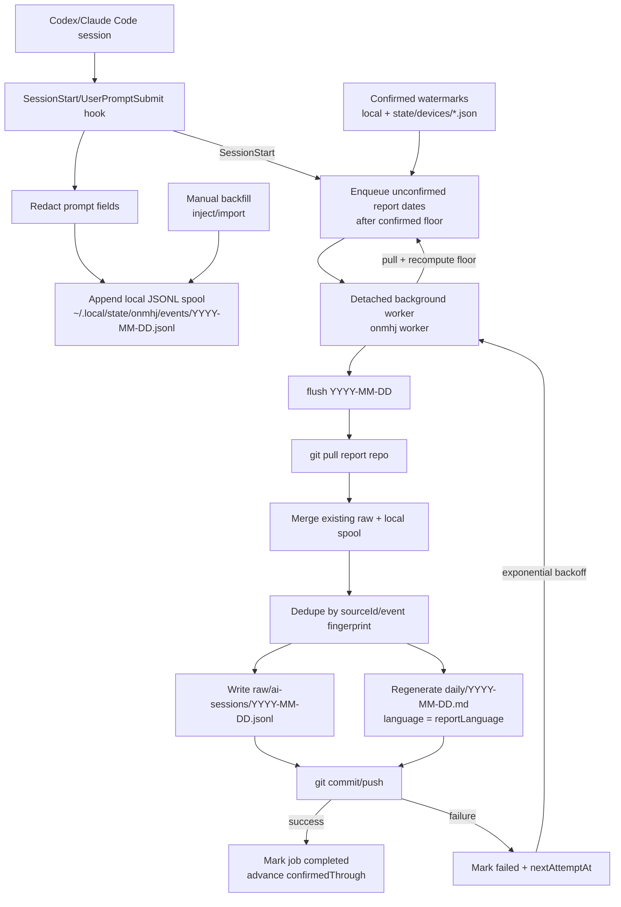

# onmhj

`onmhj` packages "what did I do today?" as a Codex and Claude Code plugin. It records hook events to local JSONL, then flushes daily logs to a registered git repo.

`ejmhj` is the companion "what did I do yesterday?" report flow.

Korean documentation: [docs/README.ko.md](./docs/README.ko.md)

## Principles

- Do not use an existing wiki repo as the default.
- Hooks only append local records.
- Each device gets a stable `deviceId` that defaults to the hostname and can be configured.
- Git sync and push only happen when `flush` is run explicitly.
- `flush` pulls the report repo, merges existing raw logs with this device's local events, dedupes, then commits.
- Normal daily report generation defaults to the active Codex/Claude Code auth (`reportAuth=agent`).
- Report markdown language follows `reportLanguage`, which defaults from the user's locale.
- OpenAI-compatible API settings are optional and intended for bulk backfill jobs.
- Git-history backfills must include only commits authored or committed by the configured owner identity.
- Prompt capture defaults to `preview`. Use `full` or `off` when needed.
- Stored prompts and report inputs get best-effort redaction for token, password, and key-like patterns.
- Event timestamps and local event filenames use UTC.
- `today`/`yesterday` decisions and report dates use the user's local timezone.

## Workflow



Multiple computers can use the same report repo. Give each computer a stable `deviceId`; every flush preserves existing events from other devices and regenerates the combined daily report. Automatic jobs cover every local event date after the confirmed floor, not just yesterday. If another device later exposes an older `confirmedThrough`, the floor drops and affected dates get queued again. Failed jobs keep retrying in the background until a flush succeeds.

## Usage

Register:

```sh
node bin/onmhj.js register /path/to/worklog-git-repo --prompt=preview
```

Set timezone:

```sh
node bin/onmhj.js register /path/to/worklog-git-repo --timezone=Asia/Seoul
```

Status:

```sh
node bin/onmhj.js status
```

Update prompt or timezone config:

```sh
node bin/onmhj.js config --timezone=Asia/Seoul --prompt=preview
```

Set this computer's device id:

```sh
node bin/onmhj.js config --device-id=macbook-pro
```

Set owner/report auth policy:

```sh
node bin/onmhj.js config --owner-name=TraceofLight --owner-email=you@example.com --report-lang=ko --report-auth=agent
```

Optional API mode for bulk backfill:

```sh
node bin/onmhj.js config --report-auth=api --report-api-base=https://example.com/v1 --report-model=model-name --report-api-key-env=ONMHJ_LLM_API_KEY
```

Manually inject one event:

```sh
node bin/onmhj.js inject --date=2026-07-08 --cwd=/path/to/repo --source=manual --source-id=manual-2026-07-08-1 --text="Work summary"
```

Import normalized JSONL events:

```sh
node bin/onmhj.js import /tmp/onmhj-backfill.jsonl
```

Flush today's records, commit, and push:

```sh
node bin/onmhj.js flush
```

Flush without pushing:

```sh
node bin/onmhj.js flush 2026-07-09 --no-push
```

## Install

Follow [Installation](./docs/installation.md).

Prompt an agent like this:

```txt
Read docs/installation.md and install onmhj for Codex.
Use /path/to/user/Documents/Github/onmhj-storage as the report repo.
After installing, run the smoke test and flush one report.
```

Claude Code can also install from the local marketplace.

Record locations:

- config: `~/.config/onmhj/config.json`
- local events: `~/.local/state/onmhj/events/YYYY-MM-DD.jsonl` UTC date
- internal logs: `~/.local/state/onmhj/internal/YYYY-MM-DD.jsonl` UTC date, prompt excluded
- report jobs: `~/.local/state/onmhj/jobs/reports/YYYY-MM-DD.json`
- local confirmed watermark: `~/.local/state/onmhj/jobs/reports/confirmed.json`
- worker log: `~/.local/state/onmhj/worker.log`
- registered repo raw: `raw/ai-sessions/YYYY-MM-DD.jsonl`, merged by local report date
- registered repo daily: `daily/YYYY-MM-DD.md` local date, with device and combined repository summaries
- registered repo device confirmations: `state/devices/DEVICE_ID.json`
