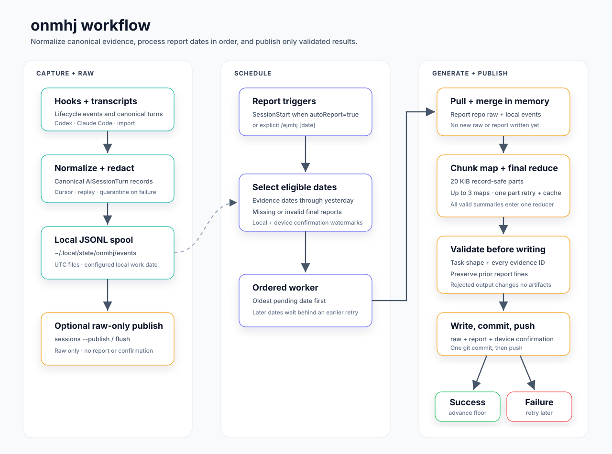

# 🤔 onmhj

Codex/Claude Code용 AI 세션 작업 로그 캡처 플러그인.

`onmhj`는 로컬 AI 코딩 세션 이벤트를 기록하고, 여러 컴퓨터의 기록을 병합한 뒤, git 기반 report repo에 날짜별 작업 로그를 발행한다. "오늘뭐했지" 캡처가 목적이고, `ejmhj`는 이 로그를 소비해 "어제뭐했지" 리포트를 만든다.

[Installation](./installation.md)

## 왜 쓰나

- local-first hook: 세션 이벤트는 git에 바로 쓰지 않고 local JSONL에 append한다.
- git-backed history: `flush`가 별도 report repo에 raw JSONL과 기계적으로 정리한 daily Markdown을 쓴다.
- automatic final reports: report job이 plugin runtime에 맞는 로컬 Claude Code 또는 Codex 로그인이나 OpenAI 호환 API를 통해 `reports/YYYY-MM-DD.md` 최종보고서를 만든다.
- multi-device safe: 컴퓨터마다 `deviceId`를 두고, 기존 raw 로그를 pull/merge/dedupe한다.
- automatic catch-up: background job이 확정되지 않은 날짜를 `confirmedThrough`가 전진할 때까지 재시도한다.
- agent auth default: Claude plugin은 로컬 Claude Code 로그인을, Codex plugin과 standalone CLI는 로컬 Codex 로그인을 쓴다. API mode는 공용이다.
- native executable override: 비표준 설치 경로는 `ONMHJ_CLAUDE_EXECUTABLE` 또는 `ONMHJ_CODEX_EXECUTABLE`로 지정한다.

## Install

[docs/installation.md](./installation.md)를 따른다.

Agent handoff prompt:

```txt
Read docs/installation.md and install onmhj for this agent platform (Codex or Claude Code).
Use /path/to/onmhj-storage as the report repo.
After installing, run the platform smoke test and generate one final report with its documented `ejmhj` command.
```

## Quick Start

설치 후 report repo를 등록한다:

```sh
node bin/onmhj.js register /path/to/worklog-git-repo --timezone=Asia/Seoul
```

device, owner, report language, auth 정책을 설정한다:

```sh
node bin/onmhj.js config \
  --device-id=macbook-pro \
  --owner-name="Your Name" \
  --owner-email=you@example.com \
  --report-lang=ko \
  --report-auth=agent
```

캡처 상태 확인:

```sh
node bin/onmhj.js status
```

수동 flush:

```sh
node bin/onmhj.js flush 2026-07-09
node bin/onmhj.js flush 2026-07-09 --no-push
```

`flush`와 worker report job은 쓰기 전에 report repo에서 `git pull --rebase --autostash`를 실행한다. `onmhj flush` 밖에서 report repo를 직접 수정하거나 custom backfill script를 돌릴 때는 먼저 report repo를 pull한 뒤, 기존 raw event를 merge/dedupe해야 한다.

## Workflow



`confirmedThrough`는 device별로 날짜 순서대로만 전진한다. 앞 날짜 report가 retry 대기 중이면 뒤 날짜 job은 pending 상태로 둔다. 느린 device는 자기 local event를 기준으로 catch-up하며, 그 device의 오래된 watermark 때문에 다른 device의 정상 final report를 다시 생성하지 않는다.

## Commands

| Command | Purpose |
| --- | --- |
| `onmhj register <repo>` | 외부 report repo 설정 |
| `onmhj config ...` | timezone, device id, owner, 자동 report, language, auth, API 설정 변경 |
| `onmhj status` | config, local event 수, confirmed floor, job 수 확인 |
| `onmhj flush [date]` | event 병합과 raw/daily 근거 발행. 날짜 확정 안 함 |
| `onmhj ejmhj [date]` | 어제 또는 지정 작업일의 raw/daily/최종보고서 발행 |
| `onmhj inject --text=...` | 수동 이벤트 1건 추가 |
| `onmhj import <events.jsonl>` | 정규화 event 또는 OpenAI-compatible request/response capture import |
| `onmhj sessions [--publish]` | Codex·Claude transcript 증분 수집 및 선택적 raw-only 단일 커밋 발행 |
| `onmhj worker` | pending report job 처리 |

plugin command는 같은 CLI로 위임한다. Codex는 `/onmhj ...`, `/ejmhj [date]`를 사용하고 Claude Code는 `/onmhj:onmhj ...`, `/onmhj:ejmhj [date]`를 사용한다.

## Backfill

수동 이벤트:

```sh
node bin/onmhj.js inject \
  --date=2026-07-08 \
  --cwd=/path/to/repo \
  --source=manual \
  --source-id=manual-2026-07-08-1 \
  --text="작업 요약"
```

Bulk import:

```sh
node bin/onmhj.js import /tmp/onmhj-backfill.jsonl
```

OpenAI-compatible capture record는 `provider`, `tsUtc`, `cwd`, 전체 `request`와 `response` object를 포함한다. importer는 canonical user message, 최종 assistant content, model, tool name만 유지한다. provider reasoning field와 tool argument는 검증하지만 저장하지 않는다.

## Canonical Session

`onmhj sessions`는 Codex와 Claude transcript를 증분 수집한다. 각 `AISessionTurn`은 안정적인 `sourceId`를 사용하므로 completed turn이 pending turn을 교체하고, 같은 session의 중복 hook preview는 제외한다. Canonical user prompt와 최종 answer는 redaction 후 전체를 저장한다.

`onmhj config --auto-report=false`를 설정하면 `SessionStart`가 report job을 예약하지 않는다. 이후 `onmhj sessions --publish`는 registered repo를 pull하고 unresolved quarantine이 없는지 확인한 뒤, 모든 local date를 `sourceId` 기준으로 `raw/ai-sessions`에 병합해 커밋과 push를 각각 한 번만 수행한다. `daily/`, `reports/`, report job, confirmation은 변경하지 않는다.

파일 cursor는 `~/.local/state/onmhj/session-ingest/`에 있다. 관련 record 파싱이 실패하면 해당 byte offset에서 멈추고 metadata-only quarantine을 남긴다. 정상 재시도로 quarantine이 해소될 때까지 영향받은 날짜의 최종보고서 확정을 차단한다.

git-history 백필은 설정된 owner identity가 author 또는 committer인 커밋만 포함해야 한다.

custom backfill은 최신 report repo 상태에서 시작해야 한다. `raw/`, `daily/`, `reports/`, `state/`를 쓰기 전에 report repo에서 `git pull --rebase --autostash`를 실행한다.

## Storage

Local machine:

- config: `~/.config/onmhj/config.json`
- events: `~/.local/state/onmhj/events/YYYY-MM-DD.jsonl`
- internal logs: `~/.local/state/onmhj/internal/YYYY-MM-DD.jsonl`
- report jobs: `~/.local/state/onmhj/jobs/reports/YYYY-MM-DD.json`
- local confirmed watermark: `~/.local/state/onmhj/jobs/reports/confirmed.json`
- worker log: `~/.local/state/onmhj/worker.log`
- transcript cursor와 quarantine: `~/.local/state/onmhj/session-ingest/`

Report repo:

- raw events: `raw/ai-sessions/YYYY-MM-DD.jsonl`
- daily evidence: `daily/YYYY-MM-DD.md`
- final report: `reports/YYYY-MM-DD.md`
- device confirmations: `state/devices/DEVICE_ID.json`

최종보고서 검증과 raw, daily, report, device confirmation 커밋이 모두 성공해야 날짜를 확정한다. 완료 상태였더라도 report가 없거나 형식이 잘못되면 자동으로 다시 queue한다.

`ejmhj --no-push`는 raw, daily, 최종보고서를 생성·커밋하지만 confirmation을 쓰지 않는다. `flush --no-push`는 raw와 daily 근거만 생성·커밋한다. 일반 `ejmhj`는 ordered job queue를 사용하므로 뒤 날짜가 앞선 retry를 건너뛰지 않고 confirmation도 역행하지 않는다.

## Safety

- hook은 local append만 한다.
- git sync/push는 `sessions --publish`, `flush`, 또는 worker 기반 report job에서만 실행한다.
- `flush`/worker는 쓰기 전에 pull한다. 직접 report repo를 수정하거나 custom backfill을 실행하면 동일한 pull을 수동으로 먼저 해야 한다.
- Canonical prompt와 최종 answer는 전체를 수집하며 reasoning과 tool argument는 저장하지 않는다.
- 최종보고서 재생성은 기존 report의 모든 비제목 줄을 보존해야 하며, 파괴적인 출력은 report 또는 confirmation을 쓰기 전에 거부한다.
- prompt/report input은 token, password, bearer credential, private key, API key류 패턴을 best-effort로 redaction한다.
- native agent report는 격리된 임시 디렉터리에서 timeout을 두고 non-interactive로 실행한다. Codex는 user config와 rule을 무시하고 read-only sandbox에서 불필요한 tool을 비활성화한다. Claude Code는 safe mode에서 customization, tool, browser integration, session persistence를 비활성화한다. evidence는 신뢰할 수 없는 데이터로 취급한다.
- report repo에 이미 staged change가 있으면 자동 발행을 거부하며 repo 전체 publication lock을 사용한다.
- report local date는 설정 timezone 기준이고, event spool 파일명은 UTC 기준이다.
