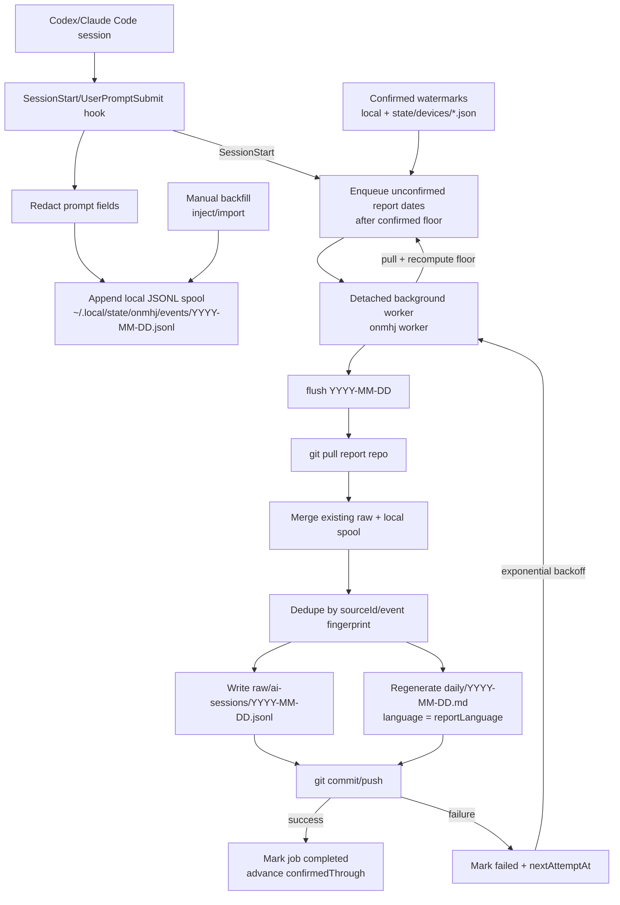

# onmhj

Codex/Claude Code용 AI 세션 작업 로그 캡처 플러그인.

`onmhj`는 로컬 AI 코딩 세션 이벤트를 기록하고, 여러 컴퓨터의 기록을 병합한 뒤, git 기반 report repo에 날짜별 작업 로그를 발행한다. "오늘뭐했지" 캡처가 목적이고, `ejmhj`는 이 로그를 소비해 "어제뭐했지" 리포트를 만든다.

[Installation](./installation.md)

## 왜 쓰나

- local-first hook: 세션 이벤트는 git에 바로 쓰지 않고 local JSONL에 append한다.
- git-backed history: `flush`가 별도 report repo에 raw JSONL과 daily Markdown을 쓴다.
- multi-device safe: 컴퓨터마다 `deviceId`를 두고, 기존 raw 로그를 pull/merge/dedupe한다.
- automatic catch-up: background job이 확정되지 않은 날짜를 `confirmedThrough`가 전진할 때까지 재시도한다.
- agent auth default: 일반 리포트 생성은 Codex/Claude Code의 active auth를 기본값으로 쓴다.

## Install

[docs/installation.md](./installation.md)를 따른다.

Agent handoff prompt:

```txt
Read docs/installation.md and install onmhj for Codex.
Use /path/to/onmhj-storage as the report repo.
After installing, run the smoke test and flush one report.
```

## Quick Start

설치 후 report repo를 등록한다:

```sh
node bin/onmhj.js register /path/to/worklog-git-repo --prompt=preview --timezone=Asia/Seoul
```

device, owner, report language, auth 정책을 설정한다:

```sh
node bin/onmhj.js config \
  --device-id=macbook-pro \
  --owner-name="Your Name" \
  --owner-email=you@example.com \
  --report-lang=ko \
  --report-auth=agent
```

캡처 상태 확인:

```sh
node bin/onmhj.js status
```

수동 flush:

```sh
node bin/onmhj.js flush 2026-07-09
node bin/onmhj.js flush 2026-07-09 --no-push
```

## Workflow



`confirmedThrough`는 날짜 순서대로만 전진한다. 앞 날짜 report가 retry 대기 중이면 뒤 날짜 job은 pending 상태로 둔다. 다른 device가 나중에 더 오래된 `confirmedThrough`를 노출하면 floor를 낮추고 영향 날짜를 다시 queue한다.

## Commands

| Command | Purpose |
| --- | --- |
| `onmhj register <repo>` | 외부 report repo 설정 |
| `onmhj config ...` | timezone, device id, owner, language, auth, API 설정 변경 |
| `onmhj status` | config, local event 수, confirmed floor, job 수 확인 |
| `onmhj flush [date]` | local/report event 병합, daily Markdown 재생성, commit/push |
| `onmhj inject --text=...` | 수동 이벤트 1건 추가 |
| `onmhj import <events.jsonl>` | 정규화된 JSONL bulk import |
| `onmhj worker` | pending report job 처리 |

## Backfill

수동 이벤트:

```sh
node bin/onmhj.js inject \
  --date=2026-07-08 \
  --cwd=/path/to/repo \
  --source=manual \
  --source-id=manual-2026-07-08-1 \
  --text="작업 요약"
```

Bulk import:

```sh
node bin/onmhj.js import /tmp/onmhj-backfill.jsonl
```

git-history 백필은 설정된 owner identity가 author 또는 committer인 커밋만 포함해야 한다.

## Storage

Local machine:

- config: `~/.config/onmhj/config.json`
- events: `~/.local/state/onmhj/events/YYYY-MM-DD.jsonl`
- internal logs: `~/.local/state/onmhj/internal/YYYY-MM-DD.jsonl`
- report jobs: `~/.local/state/onmhj/jobs/reports/YYYY-MM-DD.json`
- local confirmed watermark: `~/.local/state/onmhj/jobs/reports/confirmed.json`
- worker log: `~/.local/state/onmhj/worker.log`

Report repo:

- raw events: `raw/ai-sessions/YYYY-MM-DD.jsonl`
- daily report: `daily/YYYY-MM-DD.md`
- device confirmations: `state/devices/DEVICE_ID.json`

## Safety

- hook은 local append만 한다.
- git sync/push는 `flush` 또는 worker 기반 report job에서만 실행한다.
- prompt capture 기본값은 `preview`다. 필요하면 `full` 또는 `off`를 쓴다.
- prompt/report input은 token, password, bearer credential, private key, API key류 패턴을 best-effort로 redaction한다.
- report local date는 설정 timezone 기준이고, event spool 파일명은 UTC 기준이다.
